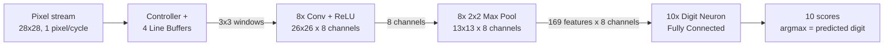

# MNIST Digit Classifier in Verilog

A from-scratch RTL implementation of a convolutional neural network that classifies handwritten digits from the MNIST dataset. The design streams a 28×28 grayscale image in pixel-by-pixel, runs it through a convolution + ReLU stage, a max-pooling stage, and a fully-connected classification stage, and outputs a raw score for each of the 10 digit classes.

All weights and biases are trained offline in PyTorch, converted to fixed-point, and instantiated directly as Verilog registers.

**Status:** RTL design complete for all modules. Simulation/verification is in progress and has not yet been completed — see [Status](#status--next-steps).

## Team

| Name | Roll Number |
|---|---|
| John Bobby | EE24BTECH11032 |
| Yamsani Harsha Vardhan | EE24BTECH11063 |

## Table of Contents

- [Pipeline Overview](#pipeline-overview)
- [Architecture](#architecture)
  - [1. Controller + Line Buffers](#1-controller--line-buffers)
  - [2. Convolution + ReLU](#2-convolution--relu)
  - [3. Max Pooling](#3-max-pooling)
  - [4. Fully Connected Digit Neurons](#4-fully-connected-digit-neurons)
  - [5. Top-Level Integration](#5-top-level-integration)
- [Fixed-Point Format](#fixed-point-format)
- [Pipeline Latency](#pipeline-latency)
- [Top-Level I/O](#top-level-io)
- [Repository Structure](#repository-structure)
- [Status / Next Steps](#status--next-steps)

## Pipeline Overview



The image arrives as a raw serial pixel stream (`i_pixel_data`, one 8-bit pixel per valid cycle, row-major order). Every stage below is a small streaming pipeline: each module consumes a valid stream and produces a valid stream, so the whole design is one continuous dataflow pipeline with no external stall/back-pressure — pixels flow in and, after a fixed pipeline delay, scores flow out.

## Architecture

### 1. Controller + Line Buffers

**Files:** `controller.v`, `line_buffer.v`

Since the convolution needs a 3×3 neighborhood of pixels but the image only arrives one pixel at a time, the controller's job is to reconstruct 3-row-tall windows from the incoming serial stream.

- Four identical `line_buffer` instances (`lB1`–`lB4`) are used, each holding one full row of the image (28 entries, indexed `line[0:27]`). Only **three of the four are ever read from at a time** — the fourth is free to be written with the next incoming row while the other three are being read out for convolution. This is a classic circular line-buffer scheme for streaming row-wise 2D convolution.
- **Write side:** incoming pixels are written into the line buffer selected by `currentWrtLB`. `pixelCounter` counts 0→27 across one row; once a full row (28 pixels) is written, `currentWrtLB` advances to the next buffer (mod 4).
- **Read side:** `totalPixelCounter` tracks how many pixels have arrived but not yet been consumed. Once at least 84 pixels (3 full rows) have accumulated, the controller's state machine moves from `IDLE` to `RD_BUFFER` and starts reading.
- While in `RD_BUFFER`, the controller performs a burst of 26 read cycles (`rd_counter` 0→25). On each cycle it reads one column position from each of the 3 active line buffers, and each `line_buffer` internally hands back 3 consecutive pixels (`o_data[0:2]`, from `rdPtr`, `rdPtr+1`, `rdPtr+2`) — so together the 3 active buffers produce a full 3×3 block per cycle. Sweeping the read pointer across the row 26 times produces all 26 valid horizontal window positions for that set of 3 rows (28-wide row → 26 valid 3-wide windows).
- Which three of the four buffers are active, and in what row order, rotates with `currentRdLB` (0,1,2,3) so that the 3-row window slides down the image one row at a time as new rows keep arriving in the background:

  | `currentRdLB` | Row order fed to `o_block_data[0..2]` |
  |---|---|
  | 0 | lB1, lB2, lB3 |
  | 1 | lB2, lB3, lB4 |
  | 2 | lB3, lB4, lB1 |
  | 3 | lB4, lB1, lB2 |

- Once a 26-cycle read burst finishes, the controller pulses `o_intr` for one cycle and returns to `IDLE` to wait for the next row to fill up before starting the next burst. Over a full 28×28 frame this produces 26 read bursts total (once per output row), yielding the full 26×26 grid of 3×3 windows needed for a valid convolution.
- `o_block_data` is a 3×3 array of 8-bit pixels (`[0:2][0:2]`), and `o_block_data_valid` pulses once per valid window — this is the interface consumed directly by the convolution stage.

### 2. Convolution + ReLU

**Files:** `conv_relu.v`, `mnist_cnn_top.v` (instantiation), `kernel_init.vh` (weight init, generated separately)

`mnist_cnn_top` instantiates **8 parallel copies** of `conv_relu` via a `generate` loop — one instance per output channel/kernel (`i_kernel_id` = 0–7). All 8 instances are fed the same `block_data` / `block_data_valid` stream from the controller simultaneously, so all 8 output feature maps are computed in parallel rather than time-multiplexed.

Each `conv_relu` instance stores all 8 kernels' 3×3 weights (`kernel[0:7][0:2][0:2]`) and all 8 biases internally as Verilog registers (loaded via `` `include "kernel_init.vh" `` in an `initial` block), but is wired with a constant `i_kernel_id` so it only ever computes the convolution for its assigned kernel.

The convolution itself is a 7-stage pipeline per instance:

1. **Stage 1 — Multiply:** all 9 pixel×weight products of the 3×3 window are computed in parallel (input zero-extended to signed before multiplying).
2. **Stage 2 — Adder tree level 1:** 9 products reduced to 5 partial sums.
3. **Stage 3 — Adder tree level 2:** 5 → 3 partial sums.
4. **Stage 4 — Adder tree level 3:** 3 → 2 partial sums.
5. **Stage 5 — Final adder:** 2 → 1, giving the raw convolution sum.
6. **Stage 6 — Bias addition:** adds this kernel's bias.
7. **Stage 7 — ReLU:** negative values are clamped to zero; non-negative values pass through unchanged, producing `o_kernel_data` (22-bit) and `o_kernel_data_valid`.

With a 28×28 input and a 3×3 kernel (stride 1, no padding), each of the 8 output feature maps is 26×26.

### 3. Max Pooling

**File:** `max_pool_2x2.v`

Each of the 8 convolution output streams is fed into its own `max_pool_2x2` instance (8 instances total, instantiated in `mnist_pool_fc.v`), performing non-overlapping 2×2 max pooling over the streaming 26×26 feature map to produce a 13×13 output — parameterized as `IMG_WIDTH=26`, `DATA_WIDTH=22`.

The module tracks its position in the incoming row-major stream with `pixel_counter` (0–25) and a `row_select` flag that toggles every 26 samples (i.e., every row):

- On **even rows** (`row_select = 0`), incoming values are simply latched into a full-row buffer, `first_row[0:25]`.
- On **odd rows** (`row_select = 1`), each incoming value is held in a single register `d` (the previous column's value), and whenever the current column index is odd (i.e., the second column of a horizontal pair) it computes the max over the 2×2 block: `max( max(first_row[col-1], first_row[col]), max(d, current) )`, and asserts `o_max_data_valid` for that cycle.

This streams out one 22-bit pooled value at a time, 13×13 = 169 total per channel, matching `NUM_FEATURES = 169` used downstream.

### 4. Fully Connected Digit Neurons

**Files:** `mnist_pool_fc.v`, `digit_neuron_0.v` … `digit_neuron_9.v` (one per digit), `digitN_weights.vh` (weight init per digit, generated separately)

`mnist_pool_fc` wires the 8 max-pool outputs into 10 identical `digit_neuron_N` instances — one per output class (digits 0–9). All 10 run in parallel off the same `pooled_data` bus and the same `neuron_valid` strobe (taken from channel 0's pool valid, assuming all 8 pooling channels stay in lock-step since they're fed identical timing).

Each `digit_neuron_N` implements one fully-connected output neuron as a **streaming dot product**, rather than buffering all 8×169 pooled values before multiplying:

- It stores its own weight matrix `weights[0:7][0:168]` (8 channels × 169 spatial positions, signed 8-bit each) and a bias, loaded from its own `digitN_weights.vh` include file.
- On every valid cycle, the pooling stage delivers one spatial position's worth of data across all 8 channels at once (`i_feature_data[0:7]`). The neuron multiplies each of the 8 channel values by the weight for that channel at the current `feature_idx`, sums the 8 products with a 3-level adder tree (`s0..s5` → `cycle_sum`), and accumulates it into a running total in `o_score`.
- `feature_idx` counts 0 → 168 (`NUM_FEATURES-1`) across the 169 spatial positions. On `feature_idx == 0` the accumulator is initialized with `cycle_sum + bias`; on every subsequent cycle it's `o_score + cycle_sum`.
- When `feature_idx` reaches 168, `o_done` pulses for one cycle and `feature_idx` resets — `o_score` now holds the finished, raw (pre-softmax) logit for that digit.

In effect, each digit neuron performs 8×169 = 1352 multiply-accumulates spread out over the 169 cycles that the pooling stage takes to stream out one full pooled image, rather than needing a separate buffering/matrix-multiply step.

The predicted digit is simply the `argmax` of the 10 `o_score` outputs once all 10 `o_done` flags have asserted.

### 5. Top-Level Integration

**File:** `mnist_cnn_top.v`

Wires the four stages together:

`i_pixel_data` → `controller` (→ 3×3 windows) → 8× `conv_relu` (→ 8 channels, 26×26) → `mnist_pool_fc`, which internally fans out to 8× `max_pool_2x2` (→ 8 channels, 13×13) → 10× `digit_neuron_N` (→ 10 scores).

The top module assumes all 8 convolution pipelines have identical latency (they're structurally identical, differing only in which kernel/bias values they hold), so a single valid signal (`kernel_valid[0]`) is used to drive the pooling stage for all 8 channels.

## Fixed-Point Format

All arithmetic is done in fixed point, denoted `Q(I,F)` — `I` integer bits (including sign) and `F` fractional bits:

| Signal | Format | Width |
|---|---|---|
| Input pixel (raw, zero-extended) | Q(9,0) | 9 b (signed) |
| Conv kernel weight | Q(2,6) | 8 b (signed) |
| Multiply result (pixel × weight) | Q(11,6) | 17 b (signed) |
| Adder tree level 1 | Q(12,6) | 18 b |
| Adder tree level 2 | Q(13,6) | 19 b |
| Adder tree level 3 | Q(14,6) | 20 b |
| Convolution sum | Q(15,6) | 21 b |
| Bias (conv) | Q(15,6) | 21 b |
| Biased sum / ReLU output / pooled value | Q(16,6) | 22 b |
| FC weight (per digit neuron) | 8 b signed | 8 b |
| FC accumulator / final score | 42 b signed | 42 b (`ACC_W`) |

## Pipeline Latency

- **Convolution + ReLU:** 7 clock cycles per sample (Stage 1 through Stage 7), fixed regardless of kernel.
- **Max pooling:** streams continuously; one 2×2-pooled output is produced roughly every 2 columns once a full pair of rows has arrived.
- **Digit neuron:** 169 cycles of MAC accumulation per completed classification (one score update per valid pooled sample), running in parallel across all 8 channels and all 10 digits.

## Top-Level I/O

**Module:** `mnist_cnn_top`

| Port | Direction | Width | Description |
|---|---|---|---|
| `i_clk` | in | 1 | Clock |
| `i_rst` | in | 1 | Synchronous reset |
| `i_pixel_data` | in | 8 | Serial grayscale pixel input |
| `i_pixel_data_valid` | in | 1 | Pixel valid strobe |
| `o_score` | out | 42 × 10 | Raw logit score per digit (0–9) |
| `o_done` | out | 10 | Per-digit "score finalized" flag |
| `o_intr` | out | 1 | Pulses once per completed row of 3×3 windows (from controller) |

## Repository Structure

```
.
├── controller.v            # Pixel stream -> 3x3 sliding windows (4 line buffers)
├── line_buffer.v            # Single-row circular buffer, used 4x by controller
├── conv_relu.v               # One kernel's 3x3 conv + bias + ReLU (7-stage pipeline), instantiated 8x
├── max_pool_2x2.v            # Streaming 2x2 max pool, instantiated 8x (one per channel)
├── mnist_pool_fc.v           # Wires 8x max-pool + 10x digit_neuron together
├── digit_neuron_0.v … digit_neuron_9.v   # One fully-connected output neuron per digit class
├── mnist_cnn_top.v            # Top-level integration
├── kernel_init.vh             # Conv kernel weights + biases (generated from trained model)
└── digit0_weights.vh … digit9_weights.vh  # FC weights + bias per digit (generated from trained model)
```

The weight files (`kernel_init.vh`, `digitN_weights.vh`) are `` `include``-d into the RTL as `initial` block assignments. They are generated by training the equivalent CNN (conv → ReLU → max-pool → FC) in PyTorch and converting the learned floating-point weights into the fixed-point formats listed above.

## Status / Next Steps

- ✅ RTL design complete for all modules: line buffering, convolution, ReLU, max pooling, and the fully-connected digit layer.
- ⏳ Functional simulation / verification against the PyTorch reference model is pending — this is the next step before the design can be considered validated.
- ⏳ Testbench, weight-file generation scripts, and any synthesis/timing results are not yet part of this repo and will be added as the project progresses.